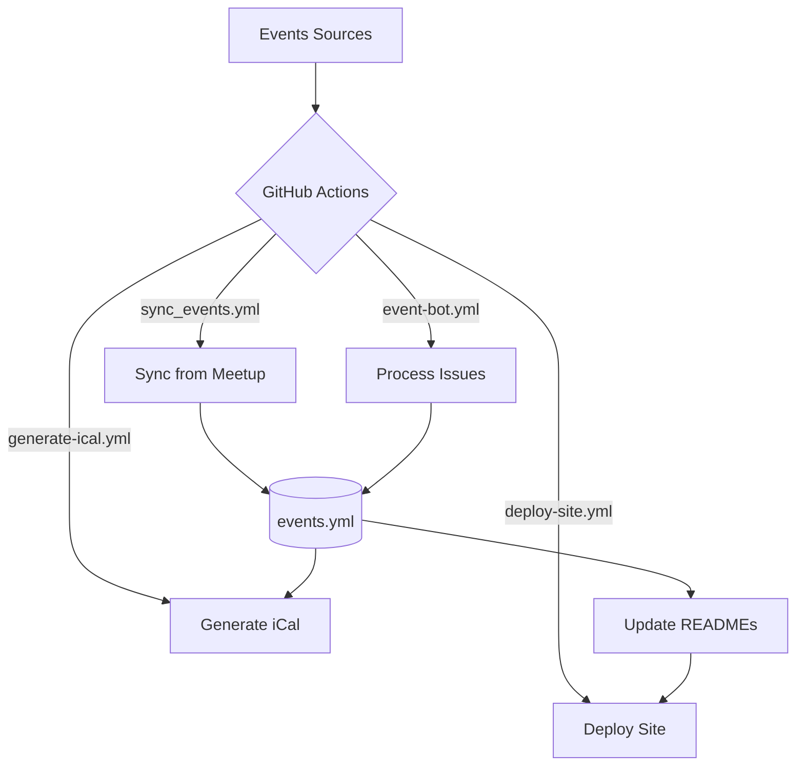
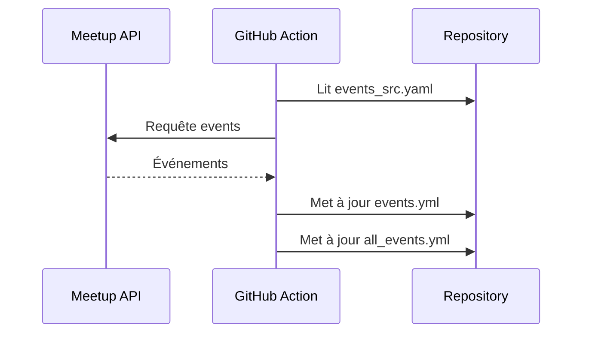
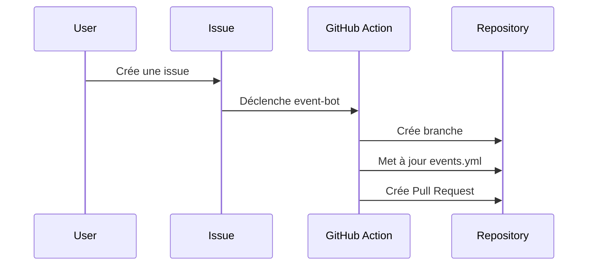
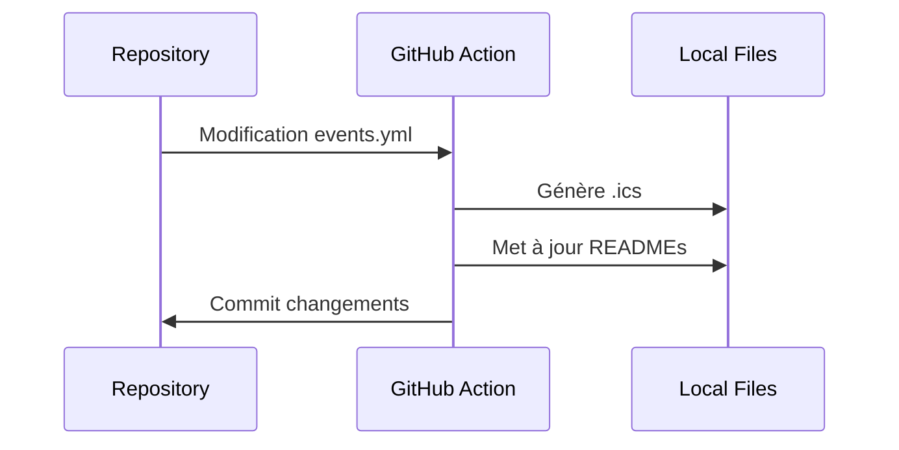
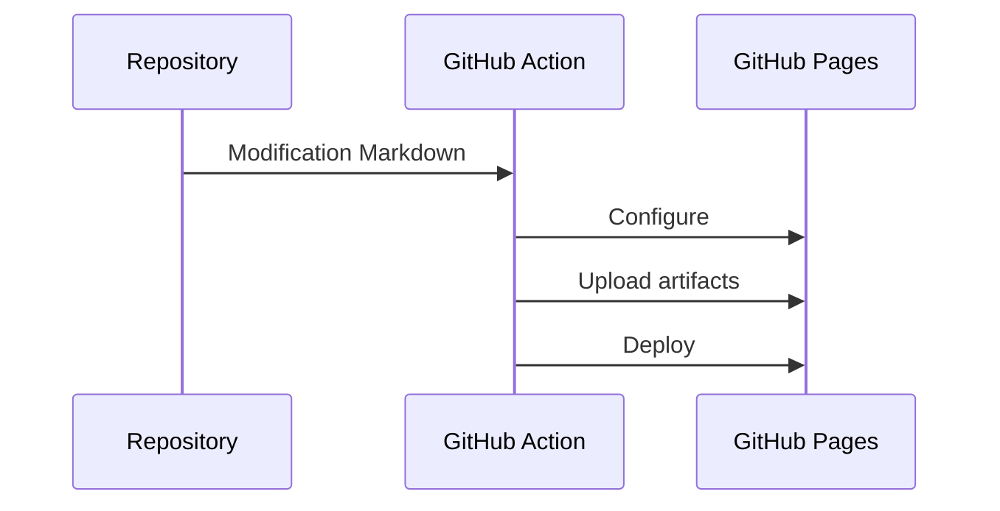

# How It Works

Ce document explique le fonctionnement du système de gestion des événements communautaires.

## Vue d'ensemble

Le projet utilise GitHub Actions pour automatiser plusieurs workflows :
- Synchronisation des événements depuis Meetup
- Ajout d'événements via les issues GitHub
- Génération de calendriers iCal
- Mise à jour des READMEs
- Déploiement du site avec Docsify



## Structure des dossiers

```
project/
├── .github/
│   ├── workflows/
│   │   ├── sync-events.yml
│   │   ├── event-bot.yml
│   │   ├── generate-ical.yml
│   │   └── deploy-site.yml
│   ├── ISSUE_TEMPLATE/
│   │   └── event.yml
│   └── scripts/
│       ├── sync_events.py
│       ├── process_event_issue.py
│       ├── generate_ical.py
│       └── update_readme.py
├── community1/
│   ├── events_src.yaml
│   ├── events.yml
│   ├── events.ics
│   └── README.md
├── community2/
│   └── ...
├── all_events.yml
├── all_events.ics
└── README.md
```

## Workflows

### 1. Synchronisation depuis Meetup



**Déclencheurs** :
- Cron journalier
- Manuel via workflow_dispatch

### 2. Ajout d'événements via Issues



**Déclencheurs** :
- Création d'une issue avec le template event

### 3. Génération iCal et mise à jour README



**Déclencheurs** :
- Après sync-events
- Après merge d'une PR d'événement
- Manuel via workflow_dispatch

### 4. Déploiement du site



**Déclencheurs** :
- Après generate-ical
- Push sur main modifiant les .md
- Manuel via workflow_dispatch

## Formats de fichiers

### events_src.yaml
```yaml
type: meetup
url: group-name
status: 
  - upcoming
  - past
```

### events.yml
```yaml
- title: Event Title
  date: '2025-02-20T18:30:00'
  url: https://...
  description: |
    Description de l'événement
  community: community-name
  location: Event Location
  is_online: false
```

## Points importants

1. **Dépendances entre workflows**
   - sync-events → generate-ical → deploy-site
   - event-bot PR merge → generate-ical → deploy-site

2. **Permissions GitHub**
   - Workflows nécessitent `contents: write`
   - deploy-site nécessite `pages: write`

3. **Locales**
   - Nécessite fr_FR.UTF-8 pour le formatage des dates
   - Configuré dans les steps des workflows

4. **Formatage**
   - Dates en français avec jour et mois
   - Description au format YAML multilignes
   - README avec sections collapsibles

## Dépannage

1. **Erreurs de synchronisation Meetup**
   - Vérifier l'URL du groupe dans events_src.yaml
   - Vérifier les permissions d'accès à l'API

2. **Issues de formatage**
   - Vérifier la locale française dans le runner
   - Vérifier le YAML multilignes pour les descriptions

3. **Déploiement**
   - Vérifier la configuration de GitHub Pages
   - Vérifier les permissions du workflow