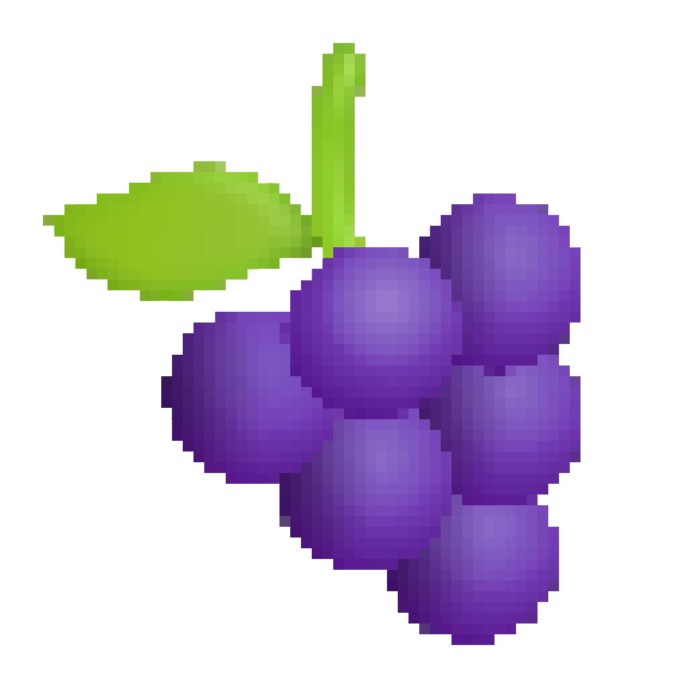

# 🌍 La Grappe Numérique - Rassemblement de presque 33 communautés du numérique bordelais

Cette page permet de retrouver l'ensemble des communautés de la grappe numérique et d'accéder à notre calendrier commun.

## Nous rejoindre numériquement

Vous pouvez joindre les communautés du numérique bordelais et échanger avec nous sur le Slack d'Okiwi ici : https://okiwi.org/slack/

## 📅 Les évènements à venir

Le calendrier des évènements est également disponible au format iCal.
Voici son URL : [https://www.lagrappenumerique.fr/events.ics](events.ics ':ignore')

<!-- ALL-EVENTS:START - Do not remove or modify this section -->
<!-- ALL-EVENTS-LIST:START -->
| Date | Community(ies) | Event | Location |
|------|------------|--------|-----------|
| Mardi 03 juin 2025 à 18:30 | [mtg-bordeaux](mtg-bordeaux/) | [Meetup MTG:Bordeaux #7](https://www.meetup.com/mtg-bordeaux/events/307780893/?utm_medium=email&utm_campaign=group-new-rsvps) | Betclic, 117 Quai de Bacalan, Bordeaux |
| Jeudi 05 juin 2025 à 18:30 | [women-in-tech-bordeaux](women-in-tech-bordeaux/) | [Produit : Discovery avec l'IA & product marketing](https://www.linkedin.com/events/produit-discoveryavecl-ia-produ7325194369152495619/about/) | SFEIR, 5 Rue de Condé, 33000 Bordeaux |
| Jeudi 12 juin 2025 à 19:00 | [bordeauxjug](bordeauxjug/) | [Les super pouvoirs du package java.util.function](https://www.bordeauxjug.org/) | ENSEIRB 1 Avenue du Docteur Albert Schweitzer · Talence |
<!-- ALL-EVENTS-LIST:END -->
<!-- ALL-EVENTS:END - Do not remove or modify this section -->

## 🍷 Les communautés Bordelaises

- [AFUP Bordeaux](afup-bordeaux/)
- [Agile Bordeaux](agile-bordeaux/)
- [Agile Tour Bordeaux](agile-tour-bordeaux/)
- [Apéro Web](apero-web/)
- [ApérOps: DataOps & MLOps](bordeaux-aperops/)
- [Aquilenet](aquilenet/)
- [Aquinum](aquinum/)
- [Archilocus](archilocus/)
- [AWS Bordeaux](aws-bordeaux/)
- [Bdx I/O](bdx-io/)
- [BordeauxJS](bordeauxjs/)
- [BordeauxJug](bordeauxjug/)
- [BordeauxKt](bordeauxkt/)
- [Bordeaux Python Meetup](bordeaux-python-meetup/)
- [Café IA](cafe-ia/)
- [Cloud Native Bordeaux](cloud-native-bordeaux/)
- [Creative Coding Bordeaux](creative-coding-bordeaux/)
- [Data for Good](data-for-good/)
- [Framer Bordeaux](framer-bordeaux/)
- [France Design Week Bordeaux](france-design-week-bordeaux/)
- [Friends of Figma Bordeaux](friends-of-figma-bordeaux/)
- [Human talks](human-talks/)
- [La boussole de la tech](la-boussole-de-la-tech/)
- [Le Nom Lieu](le-nom-lieu/)
- [MTG:Bordeaux](mtg-bordeaux/)
- [Okiwi](okiwi/)
- [OpenStreetMap France, groupe local Bordeaux](openstreetmap-bordeaux/)
- [Serious Gamers Bordeaux](serious-gamers-bordeaux/)
- [Women in Tech Bordeaux](women-in-tech-bordeaux/)

## 📅 Les grands événements de la Grappe numérique

- [BDX.IO](https://bdxio.fr/)
- [Agile Tour Bordeaux](https://agiletourbordeaux.fr/)

## 📅 Calendrier des événements

## 🖥  Carte de visite

Afin de partager rapidement ces informations, voici un QR code menant au site dédié à ce projet : [https://www.lagrappenumerique.fr/ ](https://www.lagrappenumerique.fr/#/)

## 💫 Contribution

Toute contribution est la bienvenue. Vous organisez un meetup qui n'apparait pas dans la liste, n'hésitez pas à créer une issue 😃.

Un template de fiche de communauté est disponible [👉 ici](template/template.md).

Mention spéciale au travail des communautés tech de Nantes dont nous avons répliqué le modèle https://nantes.community

Merci à tous les contributeurs 🙏

<!-- ALL-CONTRIBUTORS-LIST:START - Do not remove or modify this section -->
<!-- prettier-ignore-start -->
<!-- markdownlint-disable -->
<table>
  <tbody>
    <tr>
      <td align="center" valign="top" width="14.28%"><a href="http://akiros.it"> <b>clark</b></a> <a href="#doc-clark42" title="Documentation">📖</a></td>
      <td align="center" valign="top" width="14.28%"><a href="https://github.com/abenoit"> <b>Amélie</b></a> <a href="#doc-abenoit" title="Documentation">📖</a></td>
      <td align="center" valign="top" width="14.28%"><a href="https://www.linkedin.com/in/pierrebenayoun1976/"> <b>Pierre Benayoun</b></a> <a href="#doc-BenayounP" title="Documentation">📖</a></td>
      <td align="center" valign="top" width="14.28%"><a href="https://techwatching.dev"> <b>Alexandre Nédélec</b></a> <a href="#doc-TechWatching" title="Documentation">📖</a></td>
    </tr>
  </tbody>
</table>

<!-- markdownlint-restore -->
<!-- prettier-ignore-end -->

<!-- ALL-CONTRIBUTORS-LIST:END -->
