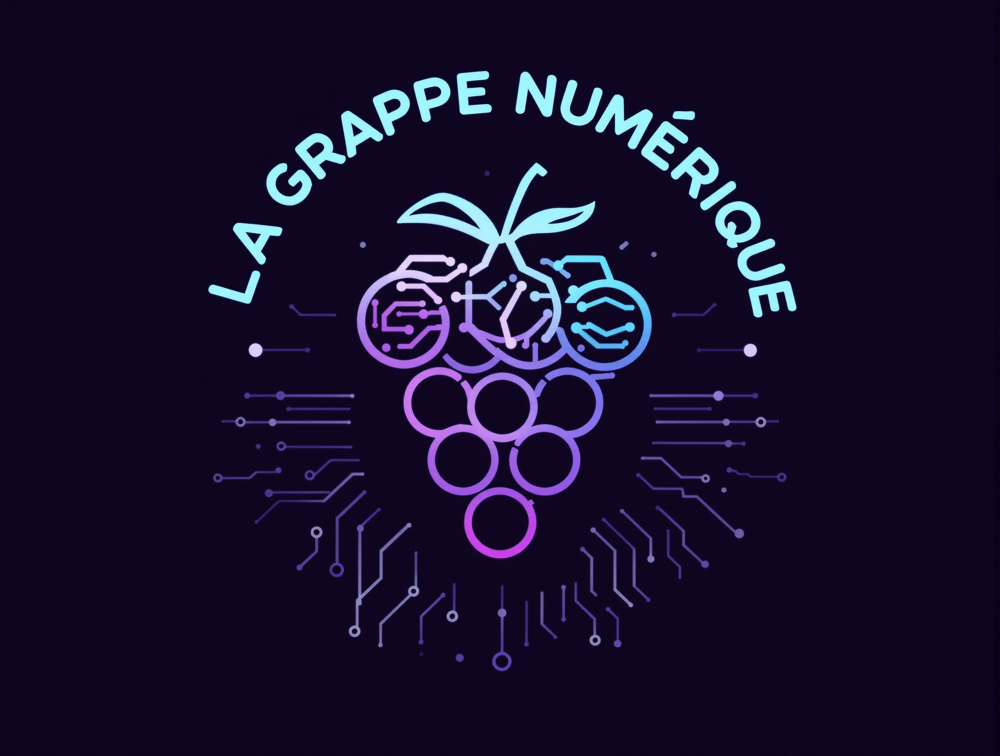

# 🌍 La Grappe Numérique - Liste des communautés du numerique Bordelais

Ce projet permet de lister les communautés bénévoles bordelaises et d'offrir des points de contacts aux personnes intéressées pour venir assister à des évènements, ou aux entreprises qui souhaiteraient recevoir l'une de ces communautés.
Vous pouvez joindre les communauté du numeriaque bordelais et échanger avec nous le Slack d'Okiwi ici: https://okiwi.org/slack/

## 📅 Les évènements à venir

Le calendrier des évènements est également disponible au format iCal.
Voici son URL : [https://www.lagrappenumerique.fr/events.ics](events.ics ':ignore')

<!-- ALL-EVENTS:START - Do not remove or modify this section -->
<!-- ALL-EVENTS-LIST:START -->
| Date | Community | Event | Location | Link |
|------|------------|--------|-----------|------|
| Jeudi 20 février 2025 à 18:30 | [aws-bordeaux](aws-bordeaux/) | Meetup AWS re:Invent re:Cap | Betclic Group 117 Quai de Bacalan Bordeaux, Nouvelle-Aquitaine 33300, Bordeaux | https://www.meetup.com/bordeaux-amazon-web-services/events/306133089/ |
| Mercredi 26 février 2025 à 19:00 | [bordeauxjs](bordeauxjs/) | La gestion d'erreurs en Javascript | 12 rue des Faussets, Bordeaux | https://www.meetup.com/bordeauxjs/events/306025718/ |
| Mercredi 26 février 2025 à 19:00 | [afup-bordeaux](afup-bordeaux/) | #57 PHP et Mémoire : Découvrez les Coulisses avec le Zend Memory Manager | 1 Cr Xavier Arnozan, Bordeaux | https://www.meetup.com/bordeaux-php-meetup/events/306119819/ |
<!-- ALL-EVENTS-LIST:END -->
<!-- ALL-EVENTS:END - Do not remove or modify this section -->

## 🍷 Les communautés Bordelaises

- [AFUP Bordeaux](afup-bordeaux/)
- [Agile Bordeaux](agile-bordeaux/)
- [Agile Tour Bordeaux](agile-tour-bordeaux/)
- [Apéro Web](apero-web/)
- [Aquilenet](aquilenet/)
- [Aquinum](aquinum/)
- [Archilocus](archilocus/)
- [AWS Bordeaux](aws-bordeaux/)
- [Bdx I/O](bdx-io/)
- [BordeauxJS](bordeauxjs/)
- [BordeauxJug](bordeauxjug/)
- [BordeauxKt](bordeauxkt/)
- [Bordeaux Python Meetup](bordeaux-python-meetup/)
- [Café IA](cafe-ia/)
- [Cloud Native Bordeaux](cloud-native-bordeaux/)
- [Creative Coding Bordeaux](creative-coding-bordeaux/)
- [Data for Good](data-for-good/)
- [Framer Bordeaux](framer-bordeaux/)
- [France Design Week Bordeaux](france-design-week-bordeaux/)
- [Friends of Figma Bordeaux](friends-of-figma-bordeaux/)
- [Human talks](human-talks/)
- [La boussole de la tech](la-boussole-de-la-tech/)
- [Le Nom Lieu](le-nom-lieu/)
- [MTG:Bordeaux](mtg-bordeaux/)
- [Okiwi](okiwi/)
- [OpenStreetMap France, groupe local Bordeaux](openstreetmap-bordeaux/)
- [Serious Gamers Bordeaux](serious-gamers-bordeaux/)
- [Women in Tech Bordeaux](women-in-tech-bordeaux/)

## 📅 Les événements Bordelais

- [BDX.IO](https://bdxio.fr/)
- [Agile Tour Bordeaux](https://agiletourbordeaux.fr/)

## 📅 Calendrier des événements

## 🖥  Carte de visite

Afin de partager rapidement ces informations, voici un QR code menant au site dédié à ce projet : [https://www.lagrappenumerique.fr/ ](https://www.lagrappenumerique.fr/#/)

## 💫 Contribution

Toute contribution est la bienvenue. Vous organisez un meetup qui n'apparait pas dans la liste, n'hésitez pas à créer une issue 😃.

Un template de fiche de communauté est disponible [👉 ici](template/template.md).

Mention spéciale au travail des communautés tech de Nantes d'ou nous avons répliquer le modèle https://nantes.community

Merci à tous les contributeurs 🙏

<!-- ALL-CONTRIBUTORS-LIST:START - Do not remove or modify this section -->
<!-- prettier-ignore-start -->
<!-- markdownlint-disable -->
<table>
  <tbody>
    <tr>
      <td align="center" valign="top" width="14.28%"><a href="http://akiros.it"> <b>clark</b></a> <a href="#doc-clark42" title="Documentation">📖</a></td>
    </tr>
  </tbody>
</table>

<!-- markdownlint-restore -->
<!-- prettier-ignore-end -->

<!-- ALL-CONTRIBUTORS-LIST:END -->
