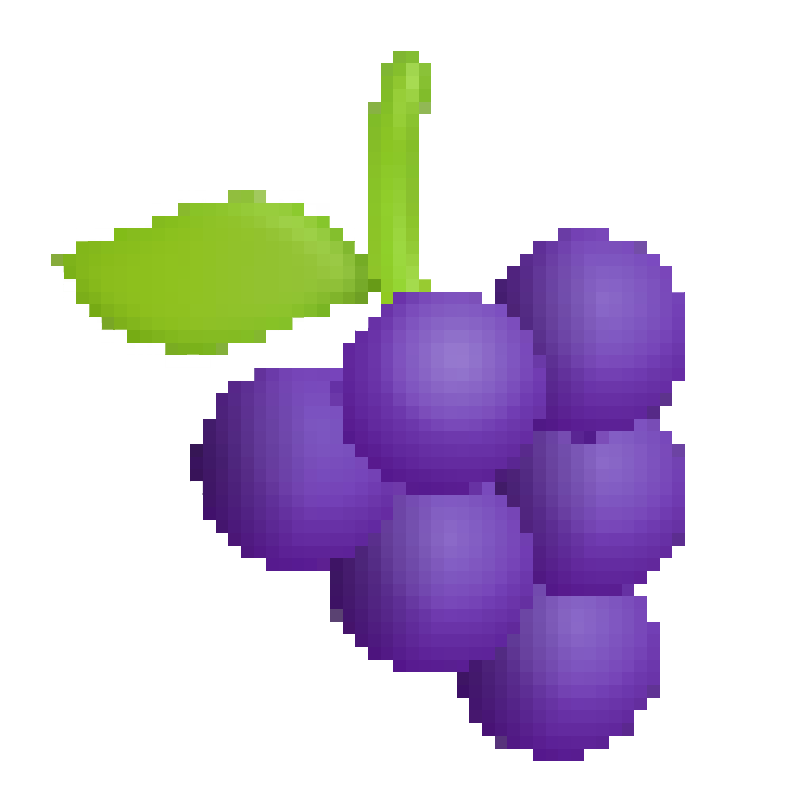

# 🌍 La Grappe Numérique - Rassemblement des communautés du numérique bordelais

La grappe numérique, c'est plus d'une trentaine de communautés du numérique bordelais. 

Nous regroupons des thèmes aussi variés que l'IA, les langages de programmation, l'agilité ou l'inclusion par le numérique. 

Cette page permet de retrouver l'ensemble des communautés et d'accéder à notre calendrier commun.

## 📅 Calendrier des événements

## 🍷Les communautés Bordelaises par thème

### Langages et plateformes

- [AFUP Bordeaux](afup-bordeaux/)
- [BordeauxJS](bordeauxjs/)
- [BordeauxJug](bordeauxjug/)
- [BordeauxKt](bordeauxkt/)
- [Bordeaux Python Meetup](bordeaux-python-meetup/)
- [Cocoaheads Bordeaux](cocoaheads/)
- [Google Developer Group Bordeaux](gdg-bordeaux/)

### Qualité et architecture logicielles

- [Archilocus](archilocus/)
- [BDX Testing Community](bdx-testing-community/)

### Cloud, infrastructure et sécurité

- [AWS Bordeaux](aws-bordeaux/)
- [BièreSecu Bordeaux](bieresecu/)
- [Cloud Native Bordeaux](cloud-native-bordeaux/)
- [MTG:Bordeaux](mtg-bordeaux/)

### Data et IA

- [Apéro IA Bordeaux](apero-web/)
- [ApérOps: DataOps & MLOps](bordeaux-aperops/)
- [Data for Good Bordeaux](data-for-good/)
- [Dev with AI](dev-with-ai/)

### Design et produit

- [France Design Week Bordeaux](france-design-week-bordeaux/)
- [Framer Bordeaux](framer-bordeaux/)
- [Friends of Figma Bordeaux](friends-of-figma-bordeaux/)
- [Women in Product Bordeaux](wip-bordeaux/)

### Agilité et facilitation

- [Agile Bordeaux](agile-bordeaux/)
- [Agile Tour Bordeaux](agile-tour-bordeaux/)
- [Human talks](human-talks/)
- [Serious Gamers Bordeaux](serious-gamers-bordeaux/)

### Création numérique et immersif

- [Bordeaux XR](bordeaux-xr/)
- [Creative Coding Bordeaux](creative-coding-bordeaux/)

### Communs numériques

- [Aquilenet](aquilenet/)
- [OpenStreetMap France, groupe local Bordeaux](openstreetmap-bordeaux/)

### Numérique pour toutes et tous

- [Café IA](cafe-ia/)
- [La boussole de la tech](la-boussole-de-la-tech/)
- [Le Nom Lieu](le-nom-lieu/)
- [Women in Tech Bordeaux](women-in-tech-bordeaux/)

### Communautés transverses

- [Aquinum](aquinum/)
- [Bdx I/O](bdx-io/)
- [DigitalNights](digitalnights/)
- [Okiwi](okiwi/)

## 📅 Les grands événements de la Grappe numérique

- [BDX.IO](https://bdxio.fr/)
- [Agile Tour Bordeaux](https://agiletourbordeaux.fr/)

## 📅 Les évènements à venir

Le calendrier des évènements est également disponible au format iCal.
Voici son URL : [https://www.lagrappenumerique.fr/events.ics](events.ics ':ignore')

<!-- ALL-EVENTS:START - Do not remove or modify this section -->
<!-- ALL-EVENTS-LIST:START -->
| Date | Community(ies) | Event | Location |
|------|------------|--------|-----------|
| Mercredi 30 septembre 2026 à 19:00 | [apero-web](apero-web/) | [🍷🤖 Apéro IA Bordeaux — Mercredi 30 septembre](https://www.meetup.com/apero-ia-bordeaux/events/316482716/) | 3 place Général-Sarrail, 33000 Bordeaux, Bordeaux |
| Jeudi 01 octobre 2026 à 18:30 | [bordeaux-xr](bordeaux-xr/) | [Bordeaux XR Meetup #7 - Meet & Greet](https://www.eventbrite.fr/e/billets-bordeaux-xr-meetup-7-meet-greet-1999402957067) | Le Node, 12 rue des Faussets, 33000 Bordeaux |
| Lundi 05 octobre 2026 à 18:30 | [okiwi](okiwi/) | [Coding dojo](https://www.meetup.com/software-crafters-bdx/events/pkmrktyjcnbhb/) | 9 Rue de Condé, Bordeaux |
<!-- ALL-EVENTS-LIST:END -->
<!-- ALL-EVENTS:END - Do not remove or modify this section -->

## 🖥  Carte de visite

Afin de partager rapidement ces informations, voici un QR code menant au site dédié à ce projet : [https://www.lagrappenumerique.fr/ ](https://www.lagrappenumerique.fr/#/)

## Nous rejoindre numériquement

Pour nous contacter : [contact@lagrappenumerique.fr](mailto:contact@lagrappenumerique.fr)

Vous pouvez aussi joindre les communautés du numérique bordelais et échanger avec nous sur le Slack d'Okiwi ici : https://okiwi.org/slack

## 💫 Contribution

Mention spéciale au travail des communautés tech de Nantes dont nous avons répliqué le modèle https://nantes.community

Merci à tous les contributeurs 🙏

<!-- ALL-CONTRIBUTORS-LIST:START - Do not remove or modify this section -->
<!-- prettier-ignore-start -->
<!-- markdownlint-disable -->
<table>
  <tbody>
    <tr>
      <td align="center" valign="top" width="14.28%"><a href="http://akiros.it"> <b>clark</b></a> <a href="#doc-clark42" title="Documentation">📖</a></td>
      <td align="center" valign="top" width="14.28%"><a href="https://github.com/abenoit"> <b>Amélie</b></a> <a href="#doc-abenoit" title="Documentation">📖</a></td>
      <td align="center" valign="top" width="14.28%"><a href="https://www.linkedin.com/in/pierrebenayoun1976/"> <b>Pierre Benayoun</b></a> <a href="#doc-BenayounP" title="Documentation">📖</a></td>
      <td align="center" valign="top" width="14.28%"><a href="https://techwatching.dev"> <b>Alexandre Nédélec</b></a> <a href="#doc-TechWatching" title="Documentation">📖</a></td>
    </tr>
  </tbody>
</table>

<!-- markdownlint-restore -->
<!-- prettier-ignore-end -->

<!-- ALL-CONTRIBUTORS-LIST:END -->
