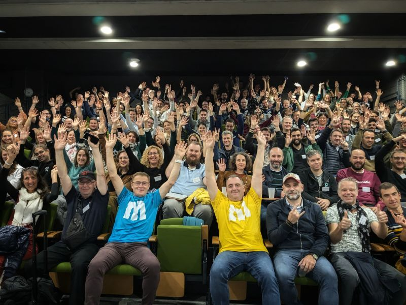

# Agile Tour Bordeaux 

L'Agile Tour Bordeaux est un événement à but non lucratif ayant lieu tous les ans, fin octobre. Il vise à essaimer les meilleures pratiques issues des approches agiles. Depuis 15 ans, cette manifestation permet à des centaines de passionné⋅e⋅s de suivre gratuitement des conférences et des ateliers.

L'Agile Tour Bordeaux est organisé et animé par une équipe enthousiaste de bénévoles, soutenue par l'association Okiwi

✉️ Contact : contact@aquinum.fr
🌍 Site web : [https://www.aquinum.fr](https://agiletourbordeaux.fr/)

<!-- EVENTS:START -->
## 📅 Upcoming Events

## 📆 Past Events
<!-- EVENTS:END -->
