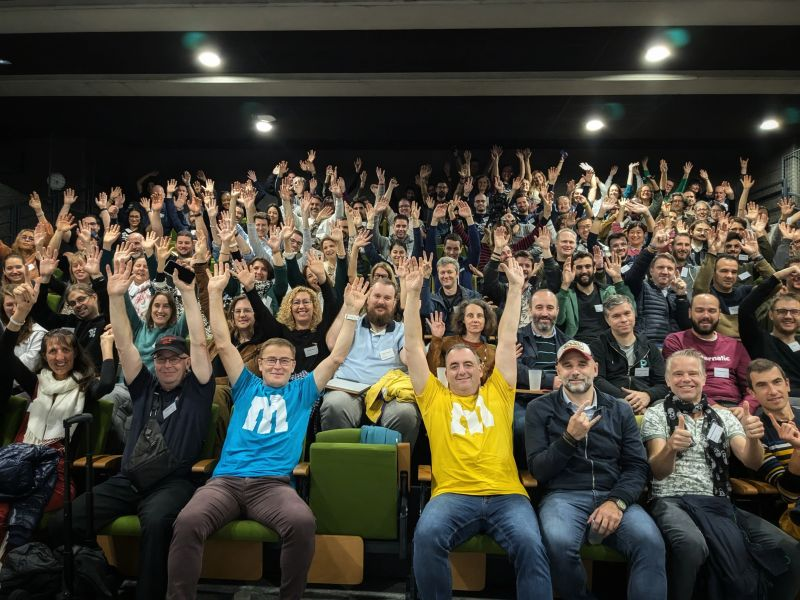

# Agile Tour Bordeaux 

L'Agile Tour Bordeaux est un événement à but non lucratif ayant lieu tous les ans, fin octobre. Il vise à essaimer les meilleures pratiques issues des approches agiles. Depuis 15 ans, cette manifestation permet à des centaines de passionné⋅e⋅s de suivre gratuitement des conférences et des ateliers.

L'Agile Tour Bordeaux est organisé et animé par une équipe enthousiaste de bénévoles, soutenue par l'association Okiwi

🌍 Site web : [agiletourbordeaux.fr](https://agiletourbordeaux.fr/)

<!-- EVENTS:START -->
## 📅 Upcoming Events

| Date | Event | Location | Link |
|------|--------|----------|------|
| Jeudi 22 octobre 2026 à 09:00 | Agile Tour Bordeaux 2026 | Ynov Campus, 2 Esplanade de la Gare, 33110 Le Bouscat | https://agiletourbordeaux.fr/evenements/atbdx-edition-2026/ |

## 📆 Past Events

2025

| Date | Event | Location | Link |
|------|--------|----------|------|
| Jeudi 30 octobre 2025 à 09:00 | Agile Tour Bordeaux 2025 | Ynov Campus, 2 Esplanade de la Gare, 33110 Le Bouscat | https://agiletourbordeaux.fr/evenements/atbdx-edition-2025/ |

<!-- EVENTS:END -->
