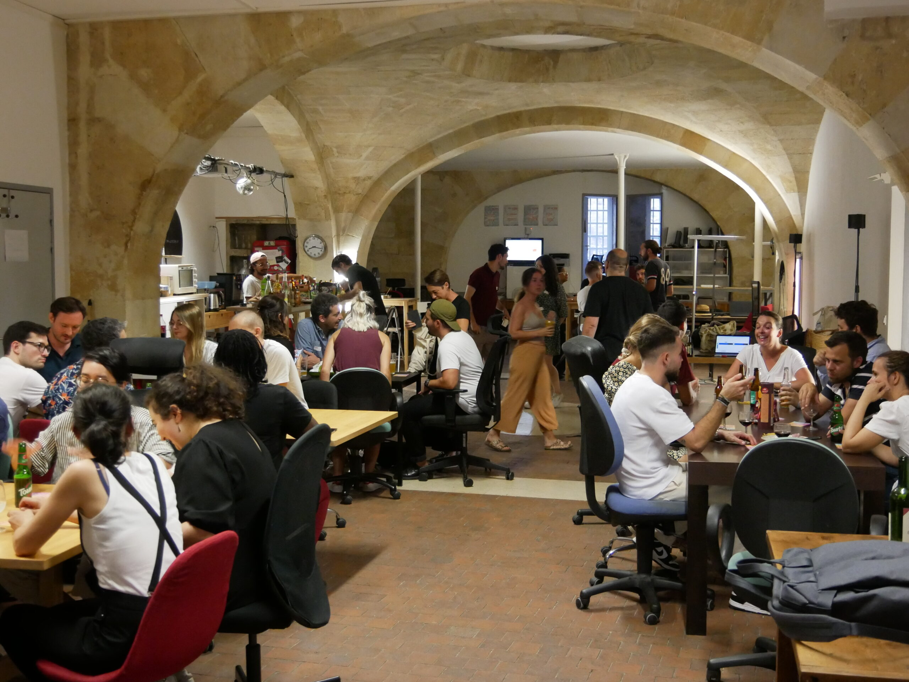

# Aquinum 

Aquinum est l'association des professionnels du numérique en Aquitaine, fondée en août 2010. Elle rassemble et anime une communauté dynamique de près de 450 membres, comprenant des professionnels établis et des futurs talents du secteur numérique.

L'association accueille une large gamme de métiers du numérique, incluant développeurs, graphistes, consultants, community managers, formateurs, et bien d'autres. Son objectif principal est de favoriser les échanges, le partage de connaissances et l'innovation au sein de l'écosystème numérique aquitain.

Aquinum a joué un rôle pionnier dans le développement du secteur numérique à Bordeaux, notamment en lançant le premier TEDx de la ville et en créant Le Node, le plus vieil espace de coworking bordelais en 2012.

L'association organise plus de 150 événements par an, contribuant ainsi activement à l'animation et au dynamisme de la communauté numérique locale.

✉️ Contact : contact@aquinum.fr
🌍 Site web : https://www.aquinum.fr

<!-- EVENTS:START -->
## 📅 Upcoming Events

| Date | Event | Location | Link |
|------|--------|----------|------|
| Jeudi 25 septembre 2025 à 18:30 | Happynum de septembre (avec Coop alpha) | Le node, 12 rue des faussets, 33000 Bordeaux | https://nextcloud.coopalpha.coop/index.php/apps/forms/s/BGs7tdKGbYgiNE33sXA2GYFm |

## 📆 Past Events

2025

| Date | Event | Location | Link |
|------|--------|----------|------|
| Jeudi 26 juin 2025 à 18:30 | Happynum de juin | Le node, 12 rue des faussets, Bordeaux | https://www.aquinum.fr/ |

<!-- EVENTS:END -->
