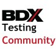

# BDX Testing Community 

La BDX Testing Community est une communauté locale dédiée au test logiciel et à la qualité logicielle (QA) sur le bassin bordelais. Elle rassemble des professionnels, des personnes en formation et des passionnés souhaitant échanger, partager des retours d’expérience et faire progresser les pratiques autour du testing

**Objectifs**

Favoriser le partage d’expérience et la montée en compétence : retours d'expérience, études de cas, démonstrations d’outils et de méthodologies.
Promouvoir l’excellence et la diversité des approches en QA : testing manuel, automatisation, tests de performance, sécurité, tests d’accessibilité, pratiques DevOps et intégration continue.
Faciliter la mise en réseau des acteurs locaux autour d’un écosystème actif sur la qualité logicielle à Bordeaux.

**Organisation et activités**

Meetups réguliers : nous organisons des rencontres périodiques à Bordeaux, ouvertes et gratuites, combinant présentations, retours d’expérience et sessions de questions/réponses. Ces meetups permettent à chacun de présenter un sujet, un projet ou un outil, dans une ambiance conviviale, bienveillante et professionnelle.
Animation collaborative : l’organisation est portée par des bénévoles membres de la communauté qui coordonnent le planning, la communication et la logistique des rencontres.

**Communauté et networking**

La BDX Testing Community est un lieu d’échanges qui favorise le networking entre tous les profils IT sur Bordeaux et sa région. Nos rencontres facilitent la création de partenariats et le soutien mutuel pour résoudre des problématiques concrètes liées au testing.
Les échanges peuvent se poursuivre en ligne via nos canaux de communication (groupe Meetup.com, Slack) pour assurer la continuité et l’ouverture à de nouveaux membres.

---

## 🔗 Rejoignez la communauté

- **🌍 LinkedIn** : https://www.linkedin.com/groups/15370013/
- **👥 Meetup.com** : [BDX Testing Community](https://www.meetup.com/bdx-testing-community/)
- **📧 Contact** : a.fontaine@lectra.com, jul.leonard@gmail.com, yann.srt@gmail.com

<!-- EVENTS:START -->
## 📆 Past Events

2026

| Date | Event | Location | Link |
|------|--------|----------|------|
| Mercredi 17 juin 2026 à 18:00 | MEETUP #5 - BDX Testing Community @SII | 3 impasse Rudolf Diesel, Mérignac | https://www.meetup.com/bdx-testing-community/events/314847233/ |
| Mercredi 28 janvier 2026 à 18:30 | APERO #4 - BDX TESTING | 45 cours D'Alsace-Et-Lorraine ,, Bordeaux | https://www.meetup.com/bdx-testing-community/events/312885328/ |

2025

| Date | Event | Location | Link |
|------|--------|----------|------|
| Mardi 02 décembre 2025 à 18:00 | MEETUP #4 - BDX Testing Community | 117 Quai de Bacalan, Bordeaux | https://www.meetup.com/bdx-testing-community/events/311642889/ |

<!-- EVENTS:END -->
