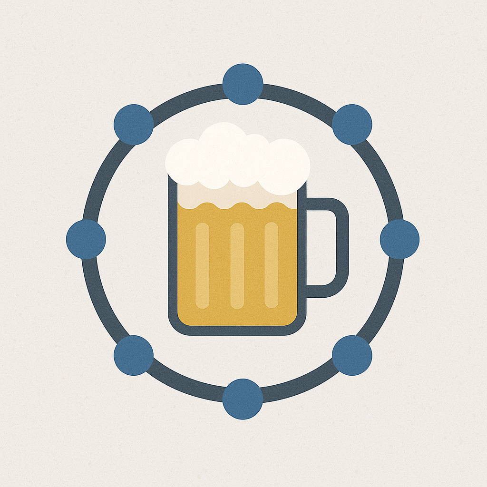

# 🚀 Bordeaux ApérOps : DataOps & MLOps 🍷

|                                |     |
| ------------------------------ | --- |
| ✉️ Luis IGLESIAS HERNANDEZ | lu.iglesiash@gmail.com
| 👥 Meetup | https://www.meetup.com/bordeaux-aperops-dataops-mlops/ |

Tu aimes l’IA en production, les pipelines qui tournent sans (trop) d’erreurs, et les discussions passionnées sur le monitoring, le CI/CD et la scalabilité… le tout autour d’un verre ? 🍻📊

Bienvenue à Bordeaux ApérOps, la communauté des passionnés de DataOps & MLOps ! Ici, on parle déploiement, monitoring, feature stores, automatisation, et bien sûr… on trinque à nos modèles qui tiennent en prod ! 🤖🔥

Que tu sois Data Engineer, Data Scientist, Dev, ou juste curieux, rejoins-nous pour :

✅ Présentation d'outils 🛠️

✅ Des partages d’expérience 🚀

✅ Un apéro, toujours 🍷🍕

📍 Rejoins-nous à Bordeaux et viens échanger avec la communauté des Ops de la data et de l’IA !

Le calendrier des évènements est disponible au format iCal.
Voici son URL : [https://www.lagrappenumerique.fr/bordeaux-aperops/events.ics](./events.ics ':ignore')

<!-- EVENTS:START -->
<!-- EVENTS:END -->
