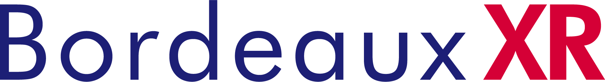
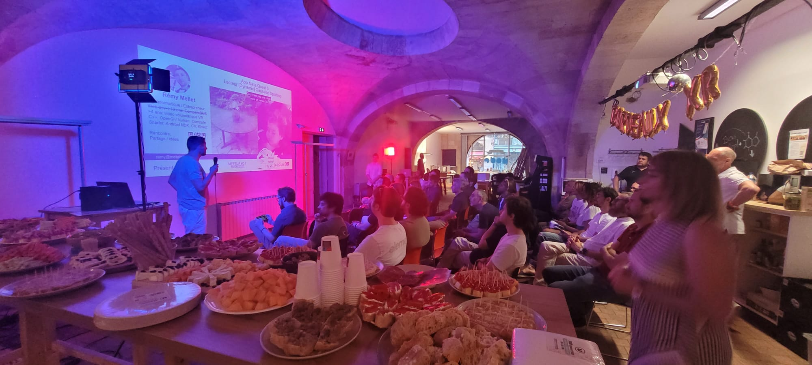

# Bordeaux XR 

## 🚀 **Bordeaux XR : Meetups Bimestriels VR/AR/MR à Bordeaux** 🎮✨

**Bordeaux XR** organise **tous les deux mois** à Bordeaux des **meetups gratuits dédiés à la réalité virtuelle (VR), augmentée (AR) et mixte (MR)** ! 🥽

## 📅 **Au programme :**
🎤 **Interventions inspirantes** :
Une ou deux présentations par des **experts du secteur** pour explorer des sujets techniques, des retours d’expérience ou des projets innovants.

🍕 **Apéro Networking** :
Un moment **détente et convivial** autour de pizzas et boissons pour échanger, partager des idées et créer des collaborations.

|                                |     |
| ------------------------------ | --- |
| ✉️ Qui contacter ?             | [Barbara Schiavi](https://www.linkedin.com/in/barbara-schiavi-phd-a1028272/), [Francois Espagnet](https://www.linkedin.com/in/francois-espagnet/), [Light LESCORNEZ](https://www.linkedin.com/in/light-lescornez-46531a28b/) et [Rémy Mellet](https://www.linkedin.com/in/remymellet/) |
| 🌍 Le site web                 | https://linktr.ee/bordeaux_xr |
| 📆 La fréquence des évènements | Bimestriel |

<!-- EVENTS:START -->
## 📅 Upcoming Events

## 📆 Past Events
<!-- EVENTS:END -->