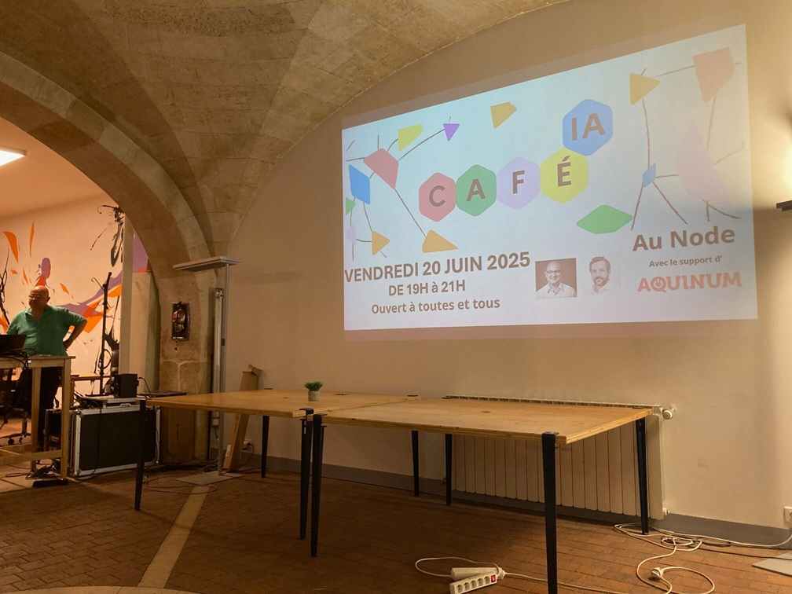

# Café IA 

Un café IA est un moment d’échange au cours duquel les participants peuvent apprendre, expérimenter et débattre pour décider de leurs usages numériques, que ce soit avec, sans ou sur l’intelligence artificielle.

C'est une démarche portée par le Conseil national du numérique devenu par décret le 4 septembre 2025  Conseil de l'intelligence artificielle et du numérique, dans la continuité d‘Itinéraires numériques et de la première proposition du rapport de la commission de l’intelligence artificielle.

Il peut être organisé par des citoyens dans toute la France. Bastien Galay et François Luc Moraud en organisent régulièrement depuis janvier 2025 à Bordeaux.

🌍 Site web : 

[Eventbrite](https://www.eventbrite.fr/e/cafe-ia-rencontre-et-debat-sur-lia-ouvert-a-toutes-et-tous-tickets-1119850686549)

<!-- EVENTS:START -->
## 📅 Upcoming Events

## 📆 Past Events
<!-- EVENTS:END -->
