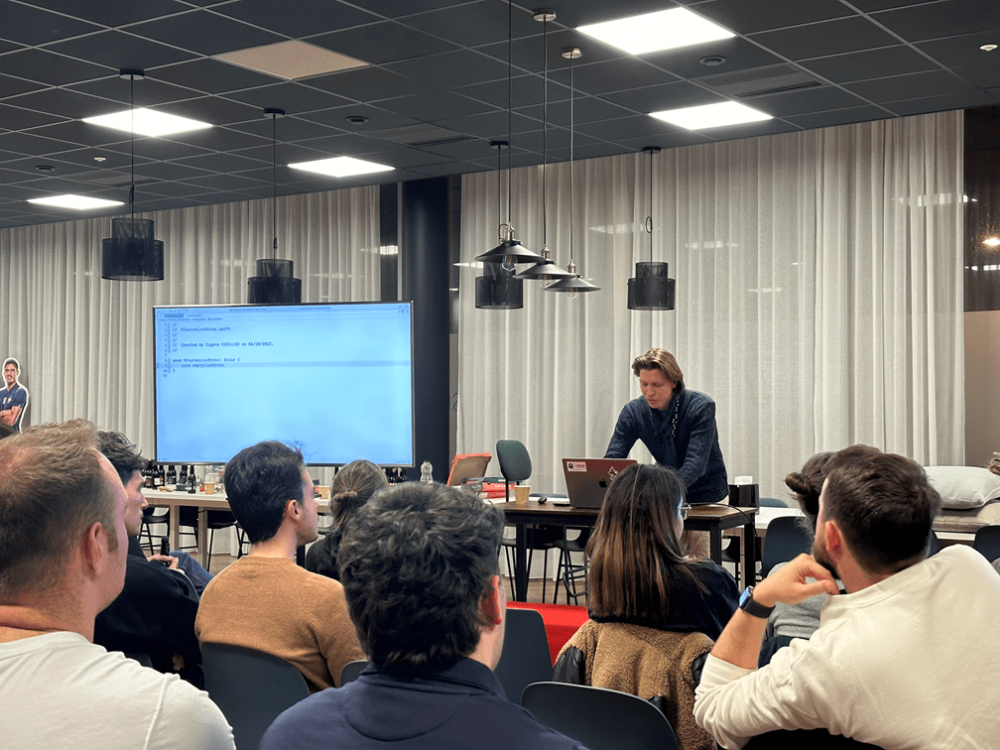

# Cocoaheads 

Bienvenue sur Cocoaheads Bordeaux, le groupe local de [http://cocoaheads.org/](http://cocoaheads.org/).

CocoaHeads est un groupe de discussion sur les frameworks Cocoa et CocoaTouch d'Apple Computer pour la programmation sur MacOS X et iOS.

Lors de nos meetups, les membres présentent leurs projets et des tutoriels sur divers sujets de programmation.

✉️ Contact : cocoaheads.bordeaux@gmail.com

🌍 Site web : https://cocoaheads-bordeaux.notion.site

<!-- EVENTS:START -->
<!-- EVENTS:END -->
