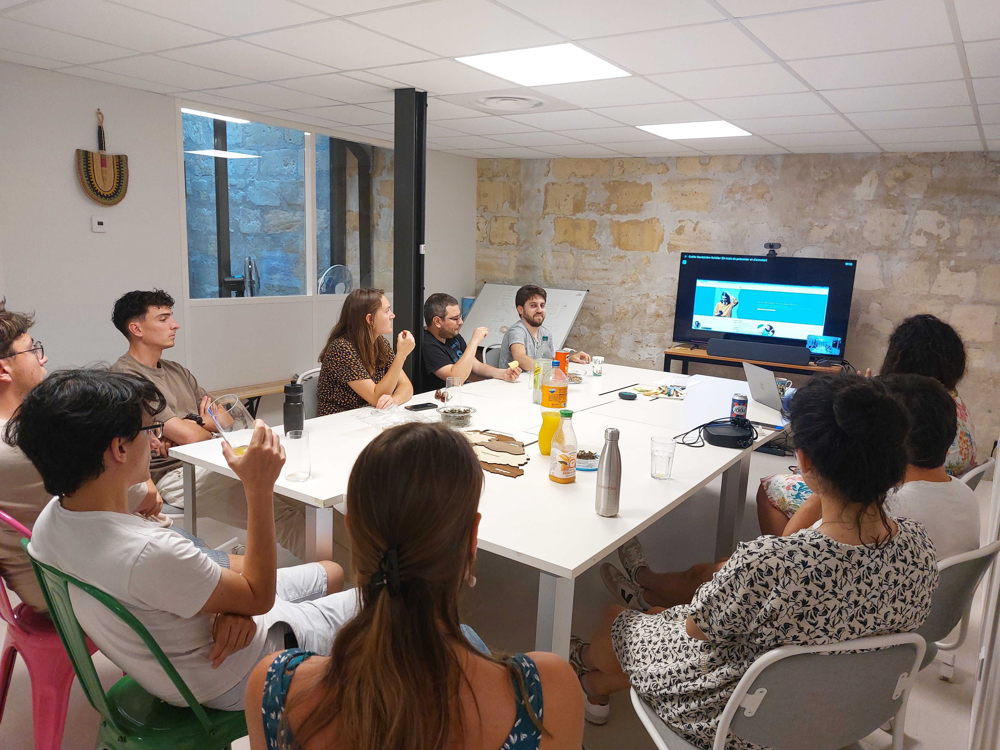

# Data for Good 

📍 Data For Good Bordeaux & Pays Basque : la tech engagée, au plus près des territoires

|                                |     |
| ------------------------------ | --- |
| ✉️ Qui contacter ?              | Gaëlle Nordström-Schüler, Valentin Defour, Azra Hamidović |
| 💻 Linkedin             | https://www.linkedin.com/company/data-for-good-bordeaux/ |
| 🌍 Site web                    | https://dataforgood.fr/ |
| Notion Calendrier       | https://dataforgood.notion.site/calendrier |

L’antenne bordelaise et celle du Pays Basque de Data For Good participent activement à faire vivre la tech au service de l’intérêt général en région Nouvelle Aquitaine. Ces communautés locales, dynamiques et engagées, organisent régulièrement :

🎉 Des afterworks réguliers (lancements de saisons, clôtures, webinaires, événements networking…)

🧑‍💻 Des sessions de peer programming entre bénévoles bordelais contribuant aux mêmes projets

💬 Un canal Slack "antenne_bordeaux", pour partager les actus locales autour de la data et de la tech à impact

🤝 Des projets locaux hors-saison, parfois en collaboration avec d’autres antennes – comme le projet Algoboost

Quelques réalisations avec la participation de nos bénévoles en 2025:

Pinkbombs : https://dataforgood.fr/projects/pinkbombs/

OD&IS : https://dataforgood.fr/projects/odis/

Potentiel S(c)olaire : https://dataforgood.fr/projects/potentielscolaire

Stop Cyberviolences : 
https://dataforgood.fr/projects/stopcyberviolence/

Créée en 2014, Data For Good est une association loi 1901 qui rassemble aujourd’hui plus de 8000 volontaires issus de la tech: Data Scientists, Data Analysts, Data Engineers, Développeurs, UX/UI Designers, Product et Project Owners… Tous unis par une même envie : mettre leurs compétences au service d’associations, d’ONG et d’acteurs de l’Économie Sociale et Solidaire (ESS).

Chaque année, nous organisons des saisons d’accélération : une dizaine de projets à fort impact social, sociétal ou environnemental sont accompagnés par nos bénévoles. Depuis notre création, plus de 100 projets ont été soutenus, accélérés et co-construits : 
🔗 https://dataforgood.fr/projects

<!-- EVENTS:START -->
## 📅 Upcoming Events

2025

| Date | Event | Location | Link |
|------|--------|----------|------|
| 09/09/2025 | Demo GenAI Impact | S38 Rue Pomme d'Or 33300 Bordeaux | https://www.eventbrite.fr/e/genai-impact-evaluation-des-impacts-environnementaux-de-lia-generative-tickets-1625133972459?aff=oddtdtcreator&utm-source=cp&utm-campaign=social&utm-content=attendeeshare&utm-medium=discovery&utm-term=listing |

## 📆 Past Events

2025

| Date | Event | Location | Link |
|------|--------|----------|------|
| 25/06/2025 | Summer Vibes | S38 Rue Pomme d'Or 33300 Bordeaux | https://www.eventbrite.fr/e/data-for-good-bordeaux-summer-vibes-tickets-1415639338369?aff=oddtdtcreator |
| 05/05/2025 | Démo Day Saison 13 | 38 Rue Pomme d'Or 33300 Bordeaux | https://www.eventbrite.fr/e/demo-day-saison-13-data-for-good-bordeaux-tickets-1329015504149?aff=oddtdtcreator |
| 24/03/2025 | RDV de mi-saison | 2 Rue Marc Sangnier 33130 Bègles | https://www.linkedin.com/posts/data-for-good-bordeaux_data-for-good-bordeaux-rdv-de-mi-saison-activity-7305929205865701377-ebUy?utm_source=share&utm_medium=member_desktop&rcm=ACoAAA4Q7ksBEG7UcHVMChLy0IQqsBJLX9kxNxg |
| 27/01/2025 | Lancement de la saison 13 ! | 2 Rue Marc Sangnier 33130 Bègles | https://www.eventbrite.com/e/1147521350249?aff=oddtdtcreator |

2024

| Date | Event | Location | Link |
|------|--------|----------|------|
| 09/12/2024 | Afterwork : Retours d'expérience des bénévoles | 38 Rue Pomme d'Or 33300 Bordeaux | https://www.eventbrite.fr/e/billets-data-for-good-bordeaux-afterwork-retours-dexperience-des-benevoles-1084009624969?aff=oddtdtcreator |
| 17/10/2024 | Afterwork de rentrée | 38 Rue Pomme d'Or 33300 Bordeaux | https://www.eventbrite.fr/e/billets-data-for-good-bordeaux-afterwork-de-rentree-1038789235567?utm-campaign=social&utm-content=attendeeshare&utm-medium=discovery&utm-term=listing&utm-source=cp&aff=ebdsshcopyurl |

<!-- EVENTS:END -->
