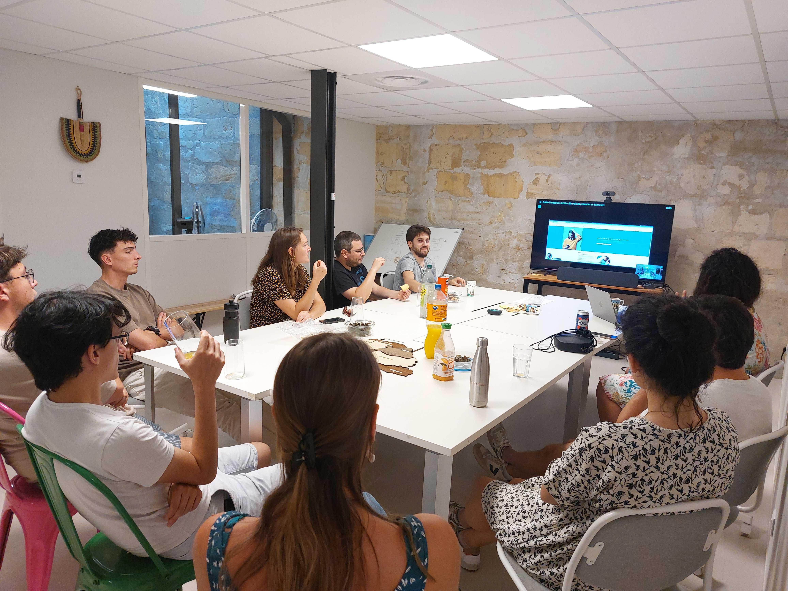

# Data for Good Bordeaux 

**📍 Data For Good Bordeaux & Pays Basque : la tech engagée, au plus près des territoires**

Data For Good est une association loi 1901 (100% bénévole, 100% open-source, 100% citoyenne) créée en 2014 qui rassemble une communauté de **8000+ volontaires** tech (Data Scientists, Data Analysts, Data Engineers, Developers, UX/UI Designers, Product & Project Owners) souhaitant mettre leurs compétences au profit d'associations, d'ONG, et de l'ESS - et de s'engager pour l'intérêt général.

Nous sommes fervents **critiques des risques et des dérives de la technologie**, faire partie de la communauté est aussi s'engager pour une technologie sobre et respectueuse des enjeux sociaux et environnementaux, et accepter que la technologie n'est pas la solution à tous les problèmes.

Nous réalisons également chaque année des **saisons d'accélération où une dizaine de projets sont accompagnés par les bénévoles sur des thématiques sociales, sociétales et environnementales**. Nous avons ainsi accompagné, accéléré et co-construits plus de 100 projets depuis 2014 (🔗 https://dataforgood.fr/projects).

**L’antenne Bordeaux et celle du Pays Basque de Data For Good** participent activement à faire vivre la tech au service de l’intérêt général en région Nouvelle Aquitaine. Ces communautés locales, dynamiques et engagées, organisent régulièrement :
- 🎉 Des afterworks réguliers (lancements de saisons, clôtures, webinaires, événements networking…)
- 🧑‍💻 Des sessions de peer programming entre bénévoles bordelais contribuant aux mêmes projets
- 💬 Un canal Slack "antenne_bordeaux", pour partager les actus locales autour de la data et de la tech à impact
- 🤝 Des projets locaux hors-saison, parfois en collaboration avec d’autres antennes – comme le projet Algoboost

Quelques réalisations de saisons avec la participation de nos bénévoles bordelais et basques en 2024 et 2025 :
- Pinkbombs : https://dataforgood.fr/projects/pinkbombs/
- OD&IS : https://dataforgood.fr/projects/odis/
- Potentiel S(c)olaire : https://dataforgood.fr/projects/potentielscolaire
- Stop Cyberviolences : https://dataforgood.fr/projects/stopcyberviolence/

| ------------------------------ | --- |
| ✉️ Qui contacter ?              | Gaëlle Nordström-Schüler, Valentin Defour, Azra Hamidović |
| 💻 Linkedin             | https://www.linkedin.com/company/data-for-good-bordeaux/ |
| 🌍 Site web                    | https://dataforgood.fr/ |
| Notion Calendrier       | https://dataforgood.notion.site/calendrier |

<!-- EVENTS:START -->
## 📅 Upcoming Events

| Date | Event | Location | Link |
|------|--------|----------|------|
| Mardi 14 avril 2026 à 18:30 | 🌱 [ATELIER - La Fresque de la Biodiversité x Data for Good Bordeaux] | Le node, 12 rue des Faussets, 33000 Bordeaux | https://www.billetweb.fr/gironde-33 |

## 📆 Past Events

2026

| Date | Event | Location | Link |
|------|--------|----------|------|
| Mercredi 25 février 2026 à 18:30 | Fresque du Numérique | Le node, Rue des Faussets, Bordeaux, France | https://www.eventbrite.fr/e/fresque-du-numerique-x-data-for-good-bordeaux-tickets-1982496539517?aff=oddtdtcreator |
| Jeudi 29 janvier 2026 à 18:30 | Lancement de la saison 14 Data For Good | Le Node, 12 Rue des Faussets  33000 Bordeaux | https://www.eventbrite.fr/e/1977881303221 |

2025

| Date | Event | Location | Link |
|------|--------|----------|------|
| Mardi 09 décembre 2025 à 19:00 | Bataille de l'IA - Data For Good Bordeaux x Latitudes | Le node, 12 rue des Faussets 33000 Bordeaux | https://www.eventbrite.fr/e/bataille-de-lia-data-for-good-bordeaux-x-latitudes-tickets-1964775632808?utm-campaign=social&utm-content=attendeeshare&utm-medium=discovery&utm-term=listing&utm-source=cp&aff=ebdsshcopyurl |
| Mercredi 29 octobre 2025 à 19:00 | Soirée 10 ans Data For Good - Data for Good Bordeaux au Node | Le node, 12 rue des Faussets | https://www.eventbrite.fr/e/soiree-10-ans-data-for-good-data-for-good-bordeaux-au-node-tickets-1825530042499?aff=oddtdtcreator |
| Mardi 09 septembre 2025 à 19:00 | Rentrée de DataForGood Bordeaux | Aquinum - Le Node 12 Rue des Faussets 33000 Bordeaux | https://www.eventbrite.fr/e/genai-impact-evaluation-des-impacts-environnementaux-de-lia-generative-tickets-1625133972459?aff=oddtdtcreator |

<!-- EVENTS:END -->
