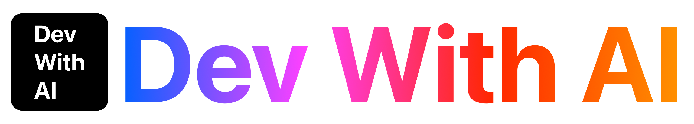

# Dev with AI 

Dev With AI est une communauté ouverte de développeurs et passionnés d’intelligence artificielle appliquée au développement logiciel.
Créée par Greg Lhotellier, elle fédère des meetups à Paris, Bordeaux et bientôt d’autres villes.
Notre objectif : partager expériences et bonnes pratiques autour de l’IA générative, explorer son impact sur la qualité logicielle, la productivité et la créativité des devs.
À Bordeaux, la communauté est animée par Cédric Teyton (Packmind) et Ludwig Vantours (freelance mobile).

---

## 🔗 Rejoignez la communauté

- **🌐 Site web** : [Dev with AI](https://devw.ai/)

<!-- EVENTS:START -->

## 📅 Upcoming Events

## 📆 Past Events

<!-- EVENTS:END -->
