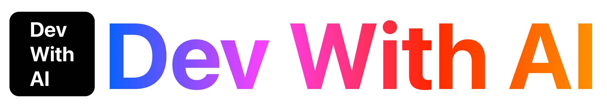

# Dev with AI 

Dev With AI est une communauté ouverte de développeurs et passionnés d’intelligence artificielle appliquée au développement logiciel.
Créée par Greg Lhotellier, elle fédère des meetups à Paris, Bordeaux et bientôt d’autres villes.
Notre objectif : partager expériences et bonnes pratiques autour de l’IA générative, explorer son impact sur la qualité logicielle, la productivité et la créativité des devs.
À Bordeaux, la communauté est animée par Cédric Teyton (Packmind) et Ludwig Vantours (freelance mobile).

---

## 🔗 Rejoignez la communauté

- **🌐 Site web** : [Dev with AI](https://devw.ai/)
- **📧 Contact** : greg@devw.ai, hello@ludwigvantours.dev, cedric.teyton@packmind.com

<!-- EVENTS:START -->
## 📅 Upcoming Events

| Date | Event | Location | Link |
|------|--------|----------|------|
| Mercredi 01 juillet 2026 à 19:00 | Dev With AI Meetup #16 @ Cap Sciences [Bordeaux] | Cap Sciences, Hangar 20, Quai de Bacalan, 33300 Bordeaux, France | https://luma.com/dm16 |

## 📆 Past Events

2025

| Date | Event | Location | Link |
|------|--------|----------|------|
| Mardi 18 novembre 2025 à 19:00 | Dev With AI Meetup #2 @ Luni | 25 Quai des Chartrons, 33300 Bordeaux | https://luma.com/8f9h2dh1 |
| Lundi 24 février 2025 à 19:00 | Dev With AI Meetup #6 @ Betclic | Betclic, 117 Quai de Bacalan, 33300 Bordeaux | https://luma.com/5bwwbafl |

<!-- EVENTS:END -->
