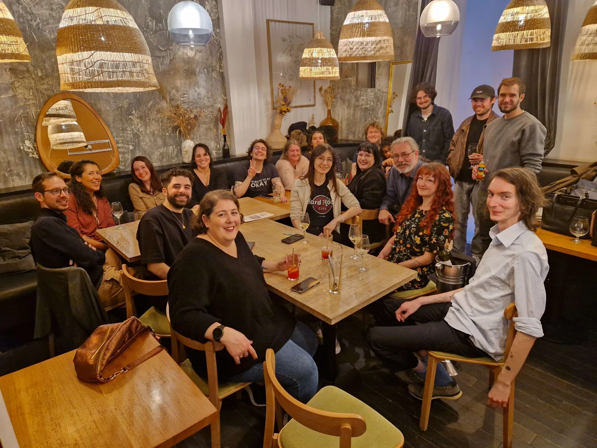

# Digital Nights 

DigitalNights c'est avant tout un serveur Discord a pour objectif de faire connaissance entre différents acteurs du web. L’idée est de créer une synergie entre différentes logiques métiers : débats, discussions, partages et conseils sont au rendez-vous.

C'est aussi un afterwork bimestriel. Rejoins-nous !

✉️ Contact : [Charlène Verrier](https://www.linkedin.com/in/charleneverrier/)

🌍 Serveur discord : https://discord.com/invite/MM87mZueKx

Le calendrier des évènements est disponible au format iCal.
Voici son URL : [https://www.lagrappenumerique.fr/digitalnights/events.ics](./events.ics ':ignore')

<!-- EVENTS:START -->
## 📅 Upcoming Events

## 📆 Past Events
<!-- EVENTS:END -->
