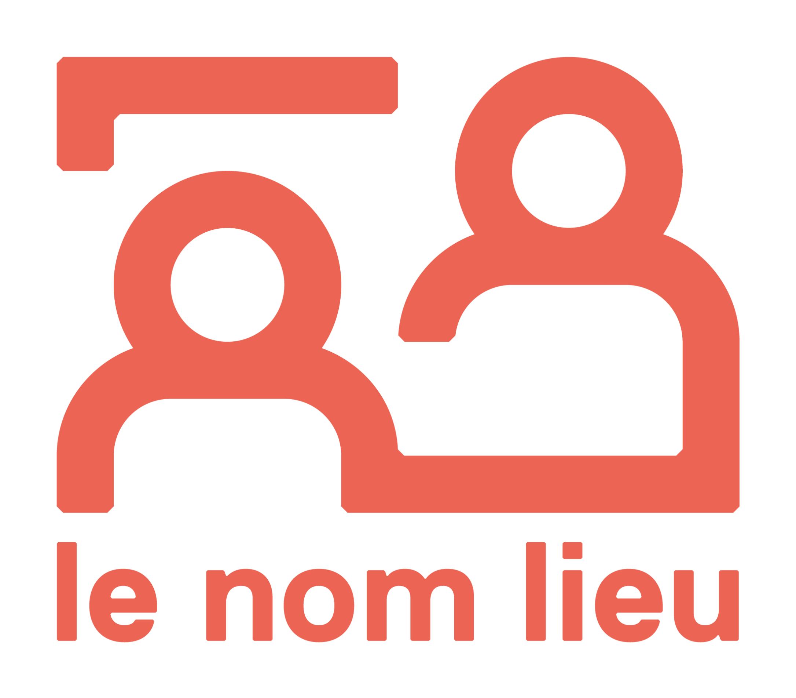

# Le Nom Lieu 

Le Nom Lieu accueille et accompagne les jeunes à partir de 16 ans en situation de fragilité psychique et/ou en situation d’exclusion, en les aidant à se re-mobiliser, en partant de leurs affinités liées aux domaines du numérique. Le Nom Lieu s’inscrit comme un sas, une passerelle entre le milieu scolaire, le secteur du médico-social et le monde du travail. 

🌍 Site web : https://lenomlieu.org/

<!-- EVENTS:START -->
## 📅 Upcoming Events

## 📆 Past Events
<!-- EVENTS:END -->
