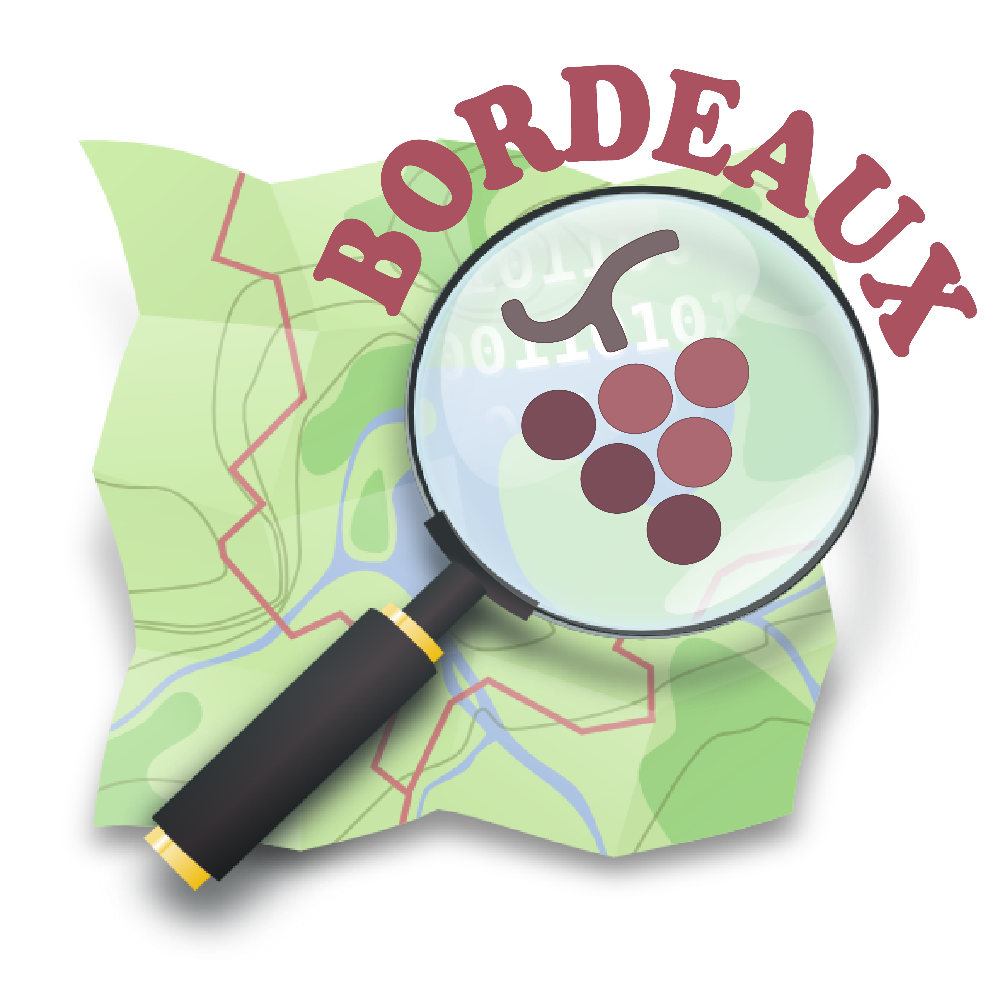
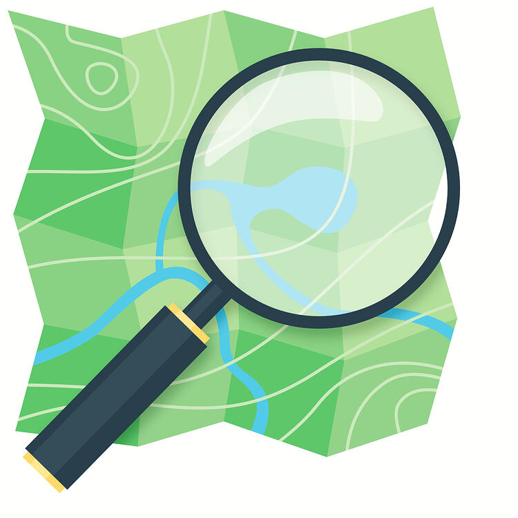

# 🗺️ OpenStreetMap, le groupe local bordelais de cartographie libre 

  
  

 

**OpenStreetMap** est une projet de cartographie libre, open-source et collaboratif, offrant une alternative aux solutions propriétaires comme Google Maps. Inspiré par le modèle Wikipédia, il comporte de nombreux outils et repose sur une communauté active qui met à jour en continu la base OSM.

L'objectif principal du groupe local bordelais est d'améliorer la qualité et la précision des données sur la métropole et l'ensemble du bassin girondin. 

Nous organisons plusieurs types d'activités :
- 🚶 Des cartoparties, qui sont des rencontres physiques pour mettre à jour les données via des observations terrain 
- 💻 Des mapathons, qui sont des rencontres en présentiel ou en distanciel pour contribuer à l'aide des éditeurs iD ou JOSM
- 🛠️  Des ateliers de découverte pour échanger et découvrir les outils de l'écosystème OSM
- 🗣️ Des présentations, des conférences, des rencontres

## 📌 Nous rejoindre

| **💻 Nos canaux**           | **🔗 Liens**         |
| -------------------------- | ------------------- |
| **✉️ Nous contacter**         | [Via notre e-mail](openstreetmap-local-bordeaux-officiel@mailo.com)   |
| **🌍 Pour discuter, échanger, proposer de nouvelles activités** | [Le forum OSM](https://forum.openstreetmap.fr/c/groupes-locaux/bordeaux/94)    |
| **📢 Suivre notre actualité** | [Sur mastodon](https://mastodon.social/@openstreetmap_local_bordeaux) |
| **💬 Suivre l'actualité du Sud-Ouest**         | [Via la liste de diffusion](https://listes.openstreetmap.fr/wws/info/local-sudouest)   |

## 🙌 Pour contribuer 

Vous trouverez un guide complet pour débuter sur le site [LearnOSM](https://learnosm.org/fr/).

Pour contribuer depuis votre mobile (Android ou iOS), vous pouvez télécharger une des applications suivantes : 

- [OSMAnd](https://osmand.net/)
- [CoMaps](https://www.comaps.app/fr/)
- [StreetComplete](https://streetcomplete.app/?lang=fr)
- [Vespucci](https://vespucci.io/)
- [Go Map!!](https://apps.apple.com/fr/app/go-map/id592990211)

## 📅 Les évènements à venir

Le calendrier des évènements est disponible au format iCal : https://www.lagrappenumerique.fr/apero-web/events.ics

### 📆 Événements passés

2026

| Date | Événement | Localisation | Lien |
|------|--------|----------|------|
| Mardi 17 mars 2026 à 09:00 | 🗺️ Mapathon en Pays Basque dans le cadre du projet européen SYSTOUR | En ligne sur Jitsi Meet | https://meet.jit.si/moderated/b6d0ff0febf76fec2fffe21b1aca93960a96876dbfeac46209cbf1be4f8c70ad |
| Mardi 24 février 2026 à 18:00 | 🗺️ Cartopartie OSM - Cartographie des bâtiments quartier Victor Hugo | Place de la victoire - Autour de la tortue 🐢 | https://forum.openstreetmap.fr/t/cartopartie-la-semaine-du-19-02/40654 |

<!-- EVENTS:END -->
